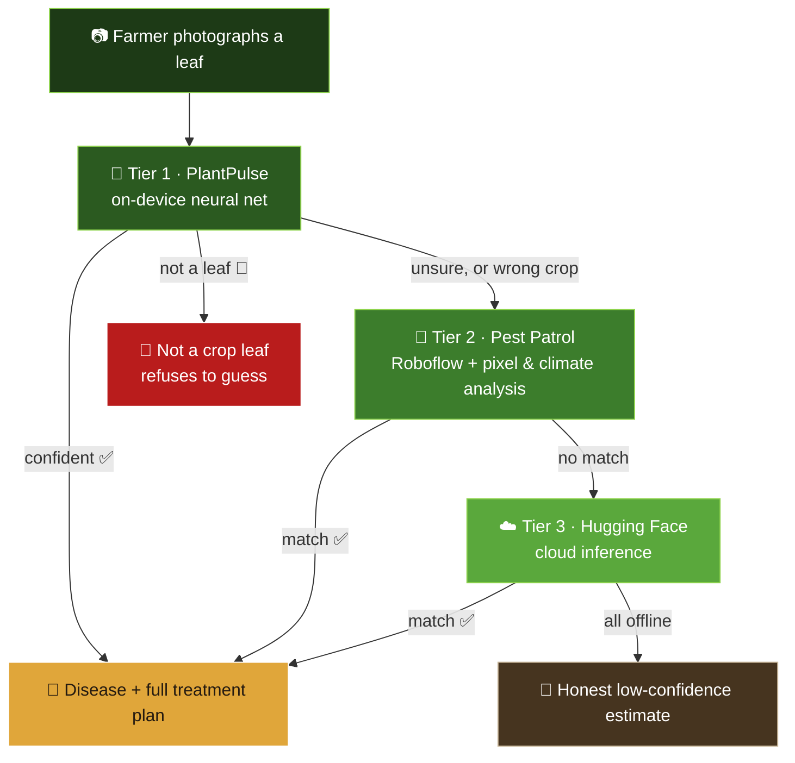
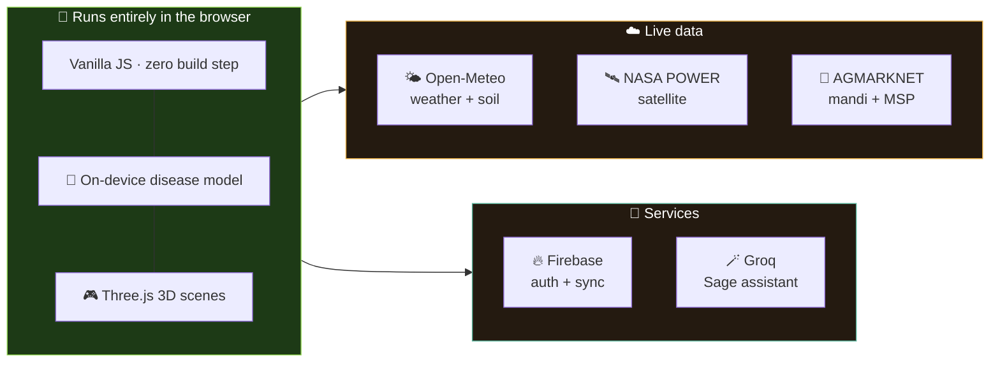

<div align="center">


# 🌾 FasalAI

### **The farm in your pocket.**
#### Point your camera at a sick leaf. Get the disease, the cure, and the price you'll sell at — in your own language, offline, on any phone.

<br />

[](#)
[](#-how-the-diagnosis-actually-works)
[](#-speaks-your-language)
[](#-run-it-in-30-seconds)

<br />

```
   ☀️                                              
        🌱  →  📷  →  🧠  →  💊  →  💰
      grow    scan   diagnose  treat   sell
```

**No app store. No install. No server. Just open it.**

</div>

---

## 🎯 The problem, in one line

> Plant pests and diseases destroy up to **40% of global food crops every year** *(FAO)* — and the farmer staring at a spotted leaf usually has **no way to know what it is** until it's too late.

India has roughly **one agricultural extension worker per thousand-plus farmers**, and almost none of that advice arrives in the farmer's own language. So people spray the wrong chemical, spray too much, poison the soil — and still lose the crop.

**FasalAI puts an agronomist in their pocket instead.**

---

## ✨ What's inside

<table>
<tr>
<td width="33%" valign="top">

### 🩺 Clinic
Photograph a leaf → the AI names the disease with a **confidence score**, then hands you organic, chemical *and* cultural treatment, plus nutrients, prevention and pruning.

**The model runs on your device.** Photos never leave the phone.

</td>
<td width="33%" valign="top">

### 💰 Profit Simulator
Drag two sliders — farm size and what you can afford to invest — and watch **yield, cost and profit** update live on an isometric field that grows with your land.

Uses **government MSP** where notified.

</td>
<td width="33%" valign="top">

### 🪄 Sage
Ask anything about your crops, by **voice or text**. Sage already knows your soil, your weather and your location, and answers in your language.

</td>
</tr>
<tr>
<td valign="top">

### 📡 Pulse
Live soil, water and air health for your exact plot — pulled from satellites and weather stations, pinned on a map.

</td>
<td valign="top">

### 🌱 Picks
Ranks what to actually grow, scored against **your** soil pH, moisture and climate right now.

</td>
<td valign="top">

### 🏪 Bazaar
Live wholesale mandi rates and government MSP, so you know **when** and **where** to sell.

</td>
</tr>
</table>

---

## 🧠 How the diagnosis actually works

Most plant-disease apps die the moment the network does. FasalAI has **three independent brains** and falls through them automatically:



> [!IMPORTANT]
> **It refuses to lie.** Point it at a dog and it says *"that doesn't look like a crop leaf"* instead of inventing a disease. Every result carries a confidence score and the top-3 alternatives.

<details>
<summary><b>🔬 Click for the nerdy details</b></summary>

<br />

| Tier | Engine | Runs where | Needs internet? |
|:--|:--|:--|:--|
| **1** | PlantPulse — ConvNeXt-Tiny + **CBAM attention** | Your device (WASM) | Only the first load |
| **2** | Pest Patrol — Roboflow + canvas pixel & climate reasoning | Hybrid | Partly |
| **3** | Hugging Face Inference API | Cloud | Yes |

**Knowledge base:** 94 crop conditions across **14 crops** — Banana, Cauliflower, Corn, Cotton, Guava, Jute, Mango, Papaya, Potato, Rice, Sugarcane, Tea, Tomato, Wheat.

Every condition is classified (healthy / fungal / bacterial / viral / pest) and returns a structured plan:

```
🌿 Organic  ·  🧪 Chemical  ·  🏡 Cultural
🧬 Nutrients (N·P·K·Ca)  ·  🛡️ Prevention  ·  ✂️ Pruning
```

**Confidence tiers:** `< 75%` low · `75–90%` moderate · `≥ 90%` high — shown as an animated ring, never hidden from the user.

</details>

---

## 💰 The Profit Simulator

<details open>
<summary><b>What makes it honest</b></summary>

<br />

Most "farm calculators" reward you for spending less. This one models the **real yield-response curve**:

```
yield
  ▲
  │           ╭──────────  ← diminishing returns
  │        ╭──╯
  │      ╭─╯
  │    ╭─╯
  │  ╭─╯
  │╭─╯                     ← below ~20% input, the crop
  ╰┴──────────────────────►   simply doesn't establish
   0        recommended       investment
```

So the profit **peaks near the recommended input cost** — which is the honest answer, not *"invest as little as possible."* Under-invest and it tells you plainly:

> *"Stretching the same money across fewer acres usually earns more than spreading it thin — try reducing the farm size slider and watch the profit rise."*

Covers **15 crops** with per-acre yields, input costs and farm-gate prices, overridden by live **MSP** where the crop is notified.

</details>

---

## 🗺️ Under the hood



**The whole app is one `index.html` file.** No webpack, no npm install, no node_modules. Open it and it works.

---

## 🚀 Run it in 30 seconds

```bash
git clone https://github.com/<your-username>/fasalai.git
cd fasalai
python3 -m http.server 5500
```

Then open **`http://127.0.0.1:5500`** 🎉

> [!WARNING]
> Open it over **`http://`**, not by double-clicking the file. Browsers block `localStorage` and Google sign-in on `file://` URLs.

<details>
<summary><b>🔑 Wiring up your own keys (optional)</b></summary>

<br />

The app ships with demo keys so it runs out of the box. To use your own, edit these constants in `index.html`:

| What | Constant | Free key from |
|:--|:--|:--|
| Sage assistant | `GROQ_API_KEY` | [console.groq.com](https://console.groq.com) |
| Cloud fallback | `HF_PLANT_KEY` | [huggingface.co](https://huggingface.co/settings/tokens) |
| Pest detection | `ROBOFLOW_API_KEY` | [roboflow.com](https://roboflow.com) |
| Mandi prices | `AGMARK_API_KEY` | [data.gov.in](https://data.gov.in) |
| Login + sync | `firebaseConfig` | [Firebase Console](https://console.firebase.google.com) |

**For Google sign-in**, in Firebase Console → *Authentication*:
1. Enable **Google** and **Email/Password** under Sign-in method
2. Add your domain under *Settings → Authorized domains*

> [!CAUTION]
> The bundled keys are **demo keys committed in client-side code**. Anyone with the file can read them. Swap in your own — and restrict them — before deploying anywhere public.

</details>

---

## 🌍 Speaks your language

<div align="center">

**109 languages**, switchable in one tap — every screen translates instantly.

`English` · `हिन्दी` · `ਪੰਜਾਬੀ` · `বাংলা` · `తెలుగు` · `मराठी` · `தமிழ்` · `ગુજરાતી` · `ಕನ್ನಡ` · `മലയാളം` · `اردو` · *…and 98 more*

</div>

Hindi, Punjabi and English are **hand-written** — including the entire guided tour — rather than machine-translated, because agricultural vocabulary matters.

---

## ♿ Built for the field, not the demo

<table>
<tr><td>🗣️</td><td><b>Voice input</b> — ask Sage out loud when typing is hard</td></tr>
<tr><td>📴</td><td><b>Works offline</b> — the disease model is cached after first load</td></tr>
<tr><td>📱</td><td><b>Runs on cheap phones</b> — no GPU, no flagship required</td></tr>
<tr><td>☀️</td><td><b>Sunlit &amp; Soil themes</b> — readable in bright field glare or at night</td></tr>
<tr><td>👆</td><td><b>Big touch targets</b>, clear icons for low-literacy users</td></tr>
<tr><td>🎓</td><td><b>Guided tour</b> — a 14-step walkthrough that <i>drives the app itself</i>, opening each page and explaining it</td></tr>
</table>

---

## 🔐 Privacy, plainly

<div align="center">

| | |
|:--|:--|
| 📷 **Leaf photos** | Analysed on your device. Never uploaded. |
| 👤 **Sign-up** | A phone number or email. That's it. |
| 💾 **Your farm data** | Stays in your browser's storage. |
| 🚫 **We sell** | Nothing. There's nothing to sell. |

</div>

---

## 🎨 Two skins

<div align="center">

| 🌙 **Soil** | ☀️ **Sunlit Loam** |
|:--:|:--:|
| Deep tilled-earth browns, warm white text, leaf-green accents | Warm parchment, dark-brown ink, orchard green |
| For night and low light | For bright daylight in the field |

*Follows your system theme automatically — or pick one.*

</div>

---

## 🗂️ Project layout

```
fasalai/
├── index.html          ← the entire app (yes, really)
├── images/
│   ├── logo.png        ← dark-mode mark
│   ├── logo-light.png  ← light-mode mark
│   └── crops/          ← 15 crop illustrations
└── README.md
```

---

## 🎯 Where this is headed

- [ ] Ship the full **94-class model bundled locally** so first load works offline too
- [ ] **PWA install** + true offline caching
- [ ] Farmer-to-farmer disease **outbreak map**
- [ ] SMS fallback for feature phones
- [ ] Regional yield data to sharpen the simulator

---

## 🤝 Contributing

Found a disease it misreads? A translation that reads awkwardly to a native speaker? **Those are the most valuable issues you can open.** Screenshots and the crop name help enormously.

---

<div align="center">

### 🌾

**Built so that the people who feed us don't have to guess.**
**Made by Aarav, Subham and Vansh**
<sub>Estimates are for planning, not guarantees. For serious crop disease, confirm with your local <b>KVK</b> or agricultural extension officer.</sub>

</div>
